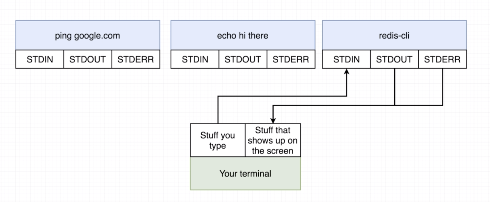
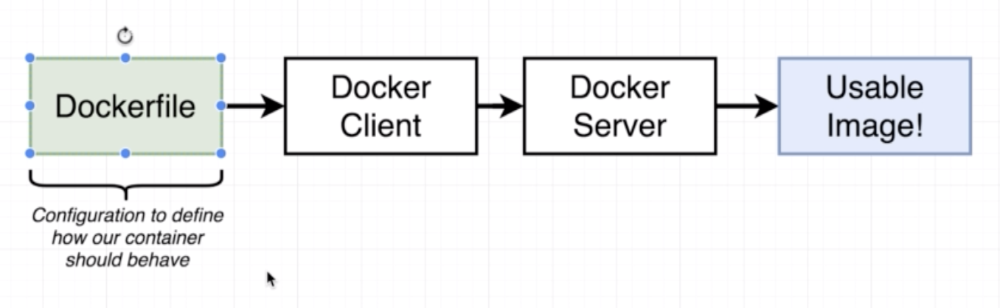
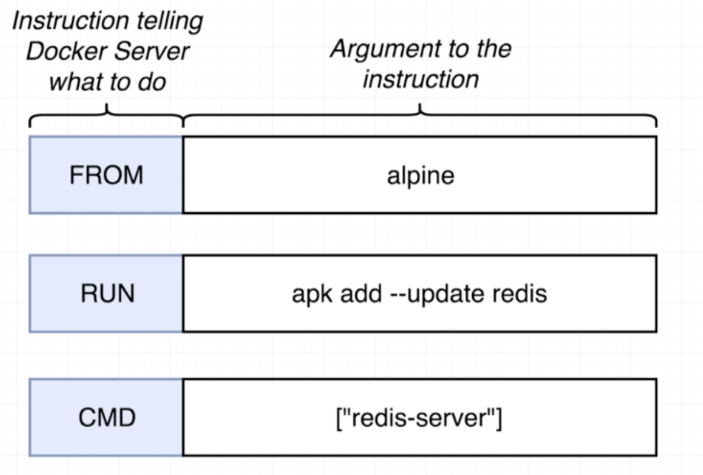
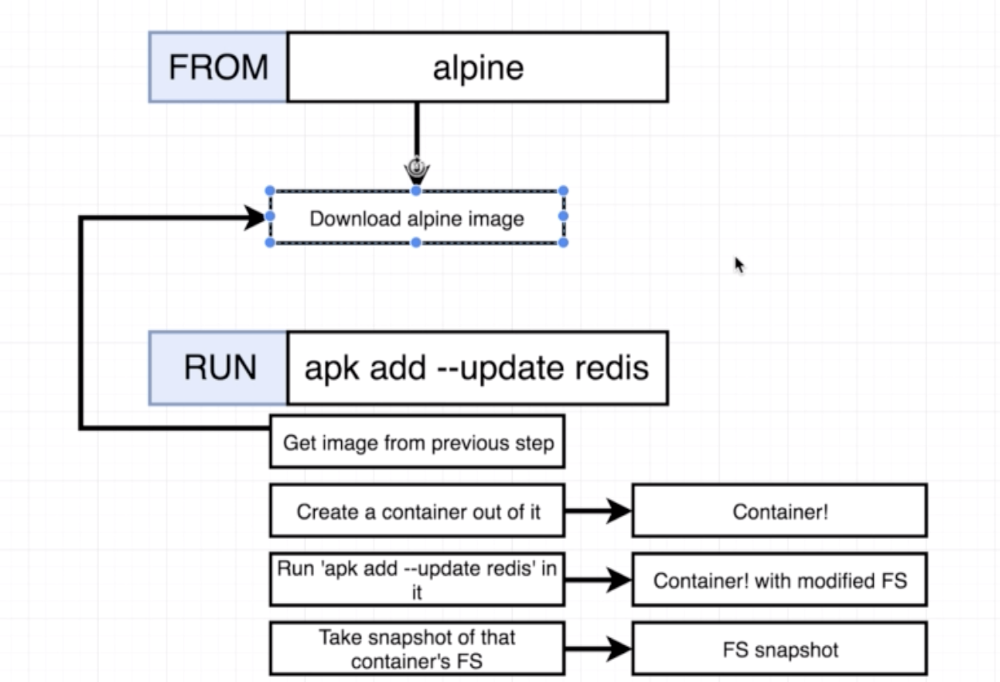
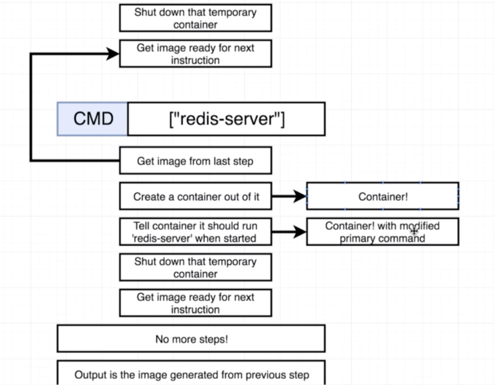

# Docker
This repository is a work-in-progress that will hold onto tutorials, cheatsheets, tips and best practices related to Docker and Kubernetes (and a bit of Travis CI and AWS). It is based largely on this awesome [Udemy course](https://www.udemy.com/docker-and-kubernetes-the-complete-guide/)
## Background
### Why Docker?

It makes it very simple to install and run software without having to worry about dependencies and setup.

### What is Docker?
Docker is an ecosystem/platform around creating and running containers

### What is an Image? What is a Container?
- Image: A single file with all the dependencies and config to install and run a program.


File System Snapshot| Run command
--- |--- | ---
Hello-world| Run Hello-World

- Container: Instance of an image that runs a program. More specifically, it is a process or group of processes with a grouping of resources assigned to it. When `docker run <image-name>` is run, the file system snapshot is 'copied' into the hard disk and the processes associated with the container are run. Two containers do not share the same filespace.


### What are Docker Client and Docker Server?
- Docker Client: A command-line interface to which we issue commands
- Docker Server: A Docker Daemon/Tool responsible for creating and running images behind the scenes

Run 
```
docker run hello-world
```
to test installation.

### How does Docker run on MacOS/Windows?
Docker makes use of a virtual machine. You can verify this by running `docker version`. In the output you will see `OS/Arch: linux/amd64` listed.


## Using Docker Client 

### Creating and Running an Container from an Image

`docker run <image-name>`

`docker run` = `docker create` + `docker start -a`

`docker create` takes the file system in the image and prepares it for running the container.

`docker start` executes the start-up command/processes in the container

For example:

- Running the `docker create hello-world` returns `2d7521b5e080c535df0682a3f7f6ce59fcf5e4aadda1d71b1cb453f72bbc12fe` which is the container ID of the container that has been created
- Running `docker start 2d7521b5e080c535df0682a3f7f6ce59fcf5e4aadda1d71b1cb453f72bbc12fe` actually runs the container
- Running `docker start -a 2d7521b5e080c535df0682a3f7f6ce59fcf5e4aadda1d71b1cb453f72bbc12fe` returns output from the running container onto the command-line. So teh argume `-a` tells docker to watch and print the output of the running container.


### Overriding the run the command
When we execute `docker run <image-name>` behind the scenes a container is created and a run command to run the container is executed. This can be overriden by using `docker run <image-name> <command>`
For example:
`docker run busybox echo hi there`. It is important to note that only commands that are relevant to the image/container can be run. For example running `docker run hello-world echo hi there` returns an error because the `echo` command is not part of the hello-world image.

### Listing running containers
`docker ps` lists running containers

For example running `docker run busybox busybox ping google.com` and then we run `docker ps` we get:

```
CONTAINER ID        IMAGE               COMMAND             CREATED             STATUS              PORTS               NAMES
b9d941ba80c3        busybox             "ping google.com"   5 seconds ago       Up 3 seconds                            brave_turing
```

`docker ps --all` returns a list of all the containers ever created
`docker ps` is used frequently to get container ID to give commands to specific containers.

### Restarting containers
We can restart a container by simply running it using the container id
For example:

```
>>>docker run busybox echo hi there
hi there
>>>docker ps --all
CONTAINER ID        IMAGE                      COMMAND                  CREATED             STATUS                         PORTS               NAMES
222a3fa494ea        busybox                    "echo hi there"          39 seconds ago      Exited (0) 37 seconds ago                          reverent_swanson
>>>docker start -a 222a3fa494ea
hi there
```

### Removing stopped containers
```
>>>docker system prune
WARNING! This will remove:
  - all stopped containers
  - all networks not used by at least one container
  - all dangling images
  - all dangling build cache

Are you sure you want to continue? [y/N] y
Deleted Containers:
222a3fa494ea4a6a1e87e08b0fe263a944aaea179436c31f7aec4c5f4a9001d6
2d7521b5e080c535df0682a3f7f6ce59fcf5e4aadda1d71b1cb453f72bbc12fe
```
This completely deletes all previously stopped containers and also removes downloaded images from cache.

### Retrieving logs

`docker logs <container-id>` can be used to retrieve information about a particular container.

### Stopping containers
1. `docker stop <container-id>` 
	- Sends a `sigterm` (terminate signal) command to the process which allows a bit of time to clean up before stopping
	- Many programs/processes/softwares can be programmed to perform own clean up process for graceful shutdown
	- However if the container does not stop within 10s, docker will issue `docker kill`
2. `docker kill <container-id>` issues `sigkill` command to the process which shuts down the process immediately

### Executing commands in a running container
`docker exec -it <container-id> <command>` for example `docker exec -it 8588fd3016cd redis-cli`

The flag `-it` is two separate flags `-i` and `-t`. `-i` is to connect to stdin of the process. `-t` is to get a nice formatting.


### Getting a command prompt inside a container
`docker exec -t <container-id> sh` 
To exit use Ctrl+d.

You can also use `docker run -it <image-name> sh` for example `docker run -it busybox sh`.


## Creating Docker Images
### Overview

 

- Dockerfile is a file which we create. It holds onto all the compexity and is the tamplate based on which a docker image is created.
- Through Docker Client (CLI) we pass the dockerfile to the Docker Server
- Docker Server creates the usable docker image based on the docker file

Steps for creating a Dockerfile:
- Specify a base image. A based image is an image that is most useful for building the image that we want to build. On alpine, `apk` is a package manager. 
- Run some commands to install additional programs
- Specify a command to run on container startup

Example:

```
# Use an existing docker image as a base
FROM alpine 

# Download and install a dependency
RUN apk add --update redis

#Tell the image what to do when it starts as a container
CMD ["redis-server"]
```


```
>>>docker build .
Sending build context to Docker daemon  2.048kB
Step 1/3 : FROM alpine
latest: Pulling from library/alpine
9d48c3bd43c5: Pull complete 
Digest: sha256:72c42ed48c3a2db31b7dafe17d275b634664a708d901ec9fd57b1529280f01fb
Status: Downloaded newer image for alpine:latest
 ---> 961769676411 
Step 2/3 : RUN apk add --update redis
 ---> Running in 7287bca897e6 
fetch http://dl-cdn.alpinelinux.org/alpine/v3.10/main/x86_64/APKINDEX.tar.gz
fetch http://dl-cdn.alpinelinux.org/alpine/v3.10/community/x86_64/APKINDEX.tar.gz
(1/1) Installing redis (5.0.5-r0)
Executing redis-5.0.5-r0.pre-install
Executing redis-5.0.5-r0.post-install
Executing busybox-1.30.1-r2.trigger
OK: 7 MiB in 15 packages
Removing intermediate container 7287bca897e6
 ---> 527f32af8c21 
Step 3/3 : CMD ["redis-server"]
 ---> Running in e75b1cc5c561
Removing intermediate container e75b1cc5c561
 ---> cf77bdfe2f66
Successfully built cf77bdfe2f66
```




### Rebuilding an image from cache
If some parts of the docker build process are the same as an image built previously, Docker will use commands from the cached version of the previously built image. The building process only builds from the changed line down.

```
# Use an existing docker image as a base
FROM alpine

# Download and install a dependency
RUN apk add --update redis
RUN apk add --update gcc #added line

#Tell the image what to do when it starts as a container
CMD ["redis-server"]
```
When we build the image the second time we get:

```
>>>docker build .
Sending build context to Docker daemon  2.048kB
Step 1/4 : FROM alpine
 ---> 961769676411
Step 2/4 : RUN apk add --update redis
 ---> Using cache
 ---> 527f32af8c21
Step 3/4 : RUN apk add --update gcc
 ---> Running in 9119b50e6acc
fetch http://dl-cdn.alpinelinux.org/alpine/v3.10/main/x86_64/APKINDEX.tar.gz
fetch http://dl-cdn.alpinelinux.org/alpine/v3.10/community/x86_64/APKINDEX.tar.gz
(1/10) Installing binutils (2.32-r0)
(2/10) Installing gmp (6.1.2-r1)
(3/10) Installing isl (0.18-r0)
(4/10) Installing libgomp (8.3.0-r0)
(5/10) Installing libatomic (8.3.0-r0)
(6/10) Installing libgcc (8.3.0-r0)
(7/10) Installing mpfr3 (3.1.5-r1)
(8/10) Installing mpc1 (1.1.0-r0)
(9/10) Installing libstdc++ (8.3.0-r0)
(10/10) Installing gcc (8.3.0-r0)
Executing busybox-1.30.1-r2.trigger
OK: 93 MiB in 25 packages
Removing intermediate container 9119b50e6acc
 ---> 265253d750a9
Step 4/4 : CMD ["redis-server"]
 ---> Running in 654bf84d16f8
Removing intermediate container 654bf84d16f8
 ---> 19854053470b
Successfully built 19854053470b
```

Building it a third time we get:

```
>>>docker build .
Sending build context to Docker daemon  2.048kB
Step 1/4 : FROM alpine
 ---> 961769676411
Step 2/4 : RUN apk add --update redis
 ---> Using cache
 ---> 527f32af8c21
Step 3/4 : RUN apk add --update gcc
 ---> Using cache
 ---> 265253d750a9
Step 4/4 : CMD ["redis-server"]
 ---> Using cache
 ---> 19854053470b
Successfully built 19854053470b
```

### Tagging an Image
`docker build -t <your-dockerid>/<your-project-name>:<version>`
Example:

```
>>>docker build -t aish/docker_example:latest .
Sending build context to Docker daemon  2.048kB
Step 1/4 : FROM alpine
 ---> 961769676411
Step 2/4 : RUN apk add --update redis
 ---> Using cache
 ---> 527f32af8c21
Step 3/4 : RUN apk add --update gcc
 ---> Using cache
 ---> 265253d750a9
Step 4/4 : CMD ["redis-server"]
 ---> Using cache
 ---> 19854053470b
Successfully built 19854053470b
Successfully tagged aish/docker_example:latest
```

You can run either:

- You can either run `docker run aish/docker_example` automatically runs the latest version
- Or `docker run aish/docker_example:<specific-version>` runs the specific version


### 'Manual' Image Generation (docker commit)
Example:

```
>>>docker run -it alpine sh
>>>/ # apk add --update redis
fetch http://dl-cdn.alpinelinux.org/alpine/v3.10/main/x86_64/APKINDEX.tar.gz
fetch http://dl-cdn.alpinelinux.org/alpine/v3.10/community/x86_64/APKINDEX.tar.gz
(1/1) Installing redis (5.0.5-r0)
Executing redis-5.0.5-r0.pre-install
Executing redis-5.0.5-r0.post-install
Executing busybox-1.30.1-r2.trigger
OK: 7 MiB in 15 packages
>>>/ # 
```
In another cli window:

```
>>>docker ps
CONTAINER ID        IMAGE               COMMAND             CREATED             STATUS              PORTS               NAMES
c4a323a09a58        alpine              "sh"                47 seconds ago      Up 46 seconds                           nifty_hypatia

>>>docker commit -c'CMD ["redis-server"]' c4a323a09a58
sha256:5ed81e065c6b18fbf0f0f6e01202b76c94bdcc7a6420206268c1b7e055d8c98d
```

