# Docker
This repository is a work-in-progress that will hold onto tutorials, cheatsheets, tips and best practices related to Docker and Kubernetes (and a bit of Travis CI and AWS). It is based largely on this awesome [Udemy course](https://www.udemy.com/docker-and-kubernetes-the-complete-guide/)

You can find some examples here:

 - [A simple container from a base image (redis)](https://github.com/aishwaryaprabhat/docker_and_kubernetes_essentials/tree/master/docker/redis-image)
- [Example of a containerized simple web app using Node JS](https://github.com/aishwaryaprabhat/docker_and_kubernetes_essentials/tree/master/docker/simpleweb)
- [Example of multi-container Node JS app](https://github.com/aishwaryaprabhat/docker_and_kubernetes_essentials/tree/master/docker/visits_multi_container)

General commands and best practices are in this README below:
 
## Background
### Why Docker?

It makes it very simple to install and run software without having to worry about dependencies and setup.

### What is Docker?
Docker is an ecosystem/platform around creating and running containers

### What is an Image? What is a Container?
- Image: A single file with all the dependencies and config to install and run a program.


File System Snapshot| Run command
--- |--- | ---
Hello-world| Run Hello-World

- Container: Instance of an image that runs a program. More specifically, it is a process or group of processes with a grouping of resources assigned to it. When `docker run <image-name>` is run, the file system snapshot is 'copied' into the hard disk and the processes associated with the container are run. Two containers do not share the same filespace.


### What are Docker Client and Docker Server?
- Docker Client: A command-line interface to which we issue commands
- Docker Server: A Docker Daemon/Tool responsible for creating and running images behind the scenes

Run 
```
docker run hello-world
```
to test installation.

### How does Docker run on MacOS/Windows?
Docker makes use of a virtual machine. You can verify this by running `docker version`. In the output you will see `OS/Arch: linux/amd64` listed.


## Using Docker Client 

### Creating and Running an Container from an Image

`docker run <image-name>`

`docker run` = `docker create` + `docker start -a`

`docker create` takes the file system in the image and prepares it for running the container.

`docker start` executes the start-up command/processes in the container

For example:

- Running the `docker create hello-world` returns `2d7521b5e080c535df0682a3f7f6ce59fcf5e4aadda1d71b1cb453f72bbc12fe` which is the container ID of the container that has been created
- Running `docker start 2d7521b5e080c535df0682a3f7f6ce59fcf5e4aadda1d71b1cb453f72bbc12fe` actually runs the container
- Running `docker start -a 2d7521b5e080c535df0682a3f7f6ce59fcf5e4aadda1d71b1cb453f72bbc12fe` returns output from the running container onto the command-line. So teh argume `-a` tells docker to watch and print the output of the running container.


### Overriding the run the command
When we execute `docker run <image-name>` behind the scenes a container is created and a run command to run the container is executed. This can be overriden by using `docker run <image-name> <command>`
For example:
`docker run busybox echo hi there`. It is important to note that only commands that are relevant to the image/container can be run. For example running `docker run hello-world echo hi there` returns an error because the `echo` command is not part of the hello-world image.

### Listing running containers
`docker ps` lists running containers

For example running `docker run busybox busybox ping google.com` and then we run `docker ps` we get:

```
CONTAINER ID        IMAGE               COMMAND             CREATED             STATUS              PORTS               NAMES
b9d941ba80c3        busybox             "ping google.com"   5 seconds ago       Up 3 seconds                            brave_turing
```

`docker ps --all` returns a list of all the containers ever created
`docker ps` is used frequently to get container ID to give commands to specific containers.

### Restarting containers
We can restart a container by simply running it using the container id
For example:

```
>>>docker run busybox echo hi there
hi there
>>>docker ps --all
CONTAINER ID        IMAGE                      COMMAND                  CREATED             STATUS                         PORTS               NAMES
222a3fa494ea        busybox                    "echo hi there"          39 seconds ago      Exited (0) 37 seconds ago                          reverent_swanson
>>>docker start -a 222a3fa494ea
hi there
```

### Removing stopped containers
```
>>>docker system prune
WARNING! This will remove:
  - all stopped containers
  - all networks not used by at least one container
  - all dangling images
  - all dangling build cache

Are you sure you want to continue? [y/N] y
Deleted Containers:
222a3fa494ea4a6a1e87e08b0fe263a944aaea179436c31f7aec4c5f4a9001d6
2d7521b5e080c535df0682a3f7f6ce59fcf5e4aadda1d71b1cb453f72bbc12fe
```
This completely deletes all previously stopped containers and also removes downloaded images from cache.

### Retrieving logs

`docker logs <container-id>` can be used to retrieve information about a particular container.

### Stopping containers
1. `docker stop <container-id>` 
	- Sends a `sigterm` (terminate signal) command to the process which allows a bit of time to clean up before stopping
	- Many programs/processes/softwares can be programmed to perform own clean up process for graceful shutdown
	- However if the container does not stop within 10s, docker will issue `docker kill`
2. `docker kill <container-id>` issues `sigkill` command to the process which shuts down the process immediately

### Executing commands in a running container
`docker exec -it <container-id> <command>` for example `docker exec -it 8588fd3016cd redis-cli`

The flag `-it` is two separate flags `-i` and `-t`. `-i` is to connect to stdin of the process. `-t` is to get a nice formatting.
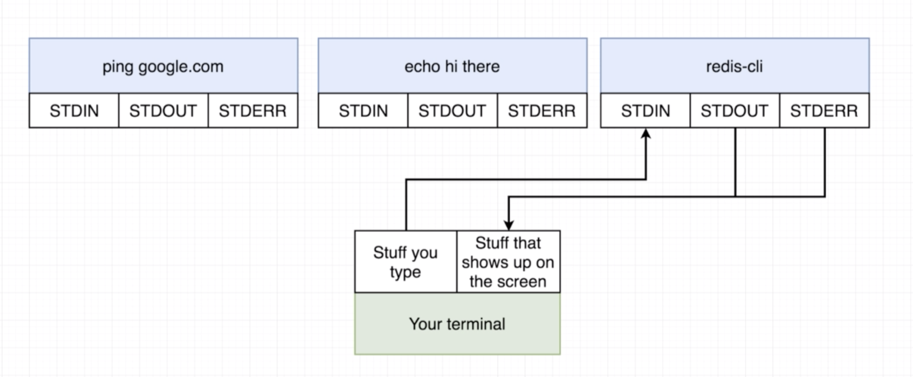

### Getting a command prompt inside a container
`docker exec -t <container-id> sh` 
To exit use Ctrl+d.

You can also use `docker run -it <image-name> sh` for example `docker run -it busybox sh`.


## Creating Docker Images
### Overview

 

- Dockerfile is a file which we create. It holds onto all the compexity and is the tamplate based on which a docker image is created.
- Through Docker Client (CLI) we pass the dockerfile to the Docker Server
- Docker Server creates the usable docker image based on the docker file

Steps for creating a Dockerfile:
- Specify a base image. A based image is an image that is most useful for building the image that we want to build. On alpine, `apk` is a package manager. 
- Run some commands to install additional programs
- Specify a command to run on container startup

Example:

```
# Use an existing docker image as a base
FROM alpine 

# Download and install a dependency
RUN apk add --update redis

#Tell the image what to do when it starts as a container
CMD ["redis-server"]
```
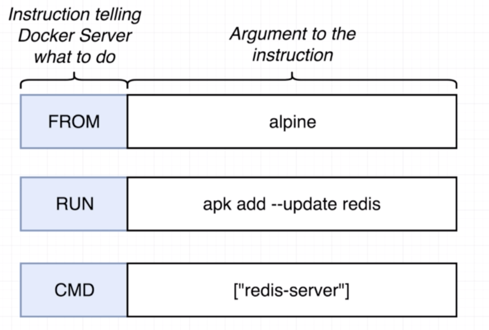

```
>>>docker build .
Sending build context to Docker daemon  2.048kB
Step 1/3 : FROM alpine
latest: Pulling from library/alpine
9d48c3bd43c5: Pull complete 
Digest: sha256:72c42ed48c3a2db31b7dafe17d275b634664a708d901ec9fd57b1529280f01fb
Status: Downloaded newer image for alpine:latest
 ---> 961769676411 
Step 2/3 : RUN apk add --update redis
 ---> Running in 7287bca897e6 
fetch http://dl-cdn.alpinelinux.org/alpine/v3.10/main/x86_64/APKINDEX.tar.gz
fetch http://dl-cdn.alpinelinux.org/alpine/v3.10/community/x86_64/APKINDEX.tar.gz
(1/1) Installing redis (5.0.5-r0)
Executing redis-5.0.5-r0.pre-install
Executing redis-5.0.5-r0.post-install
Executing busybox-1.30.1-r2.trigger
OK: 7 MiB in 15 packages
Removing intermediate container 7287bca897e6
 ---> 527f32af8c21 
Step 3/3 : CMD ["redis-server"]
 ---> Running in e75b1cc5c561
Removing intermediate container e75b1cc5c561
 ---> cf77bdfe2f66
Successfully built cf77bdfe2f66
```


To build from a specific file we use `docker build -f <name-of-specific-file> .`

### Rebuilding an image from cache
If some parts of the docker build process are the same as an image built previously, Docker will use commands from the cached version of the previously built image. The building process only builds from the changed line down.

```
# Use an existing docker image as a base
FROM alpine

# Download and install a dependency
RUN apk add --update redis
RUN apk add --update gcc #added line

#Tell the image what to do when it starts as a container
CMD ["redis-server"]
```
When we build the image the second time we get:

```
>>>docker build .
Sending build context to Docker daemon  2.048kB
Step 1/4 : FROM alpine
 ---> 961769676411
Step 2/4 : RUN apk add --update redis
 ---> Using cache
 ---> 527f32af8c21
Step 3/4 : RUN apk add --update gcc
 ---> Running in 9119b50e6acc
fetch http://dl-cdn.alpinelinux.org/alpine/v3.10/main/x86_64/APKINDEX.tar.gz
fetch http://dl-cdn.alpinelinux.org/alpine/v3.10/community/x86_64/APKINDEX.tar.gz
(1/10) Installing binutils (2.32-r0)
(2/10) Installing gmp (6.1.2-r1)
(3/10) Installing isl (0.18-r0)
(4/10) Installing libgomp (8.3.0-r0)
(5/10) Installing libatomic (8.3.0-r0)
(6/10) Installing libgcc (8.3.0-r0)
(7/10) Installing mpfr3 (3.1.5-r1)
(8/10) Installing mpc1 (1.1.0-r0)
(9/10) Installing libstdc++ (8.3.0-r0)
(10/10) Installing gcc (8.3.0-r0)
Executing busybox-1.30.1-r2.trigger
OK: 93 MiB in 25 packages
Removing intermediate container 9119b50e6acc
 ---> 265253d750a9
Step 4/4 : CMD ["redis-server"]
 ---> Running in 654bf84d16f8
Removing intermediate container 654bf84d16f8
 ---> 19854053470b
Successfully built 19854053470b
```

Building it a third time we get:

```
>>>docker build .
Sending build context to Docker daemon  2.048kB
Step 1/4 : FROM alpine
 ---> 961769676411
Step 2/4 : RUN apk add --update redis
 ---> Using cache
 ---> 527f32af8c21
Step 3/4 : RUN apk add --update gcc
 ---> Using cache
 ---> 265253d750a9
Step 4/4 : CMD ["redis-server"]
 ---> Using cache
 ---> 19854053470b
Successfully built 19854053470b
```

### Tagging an Image
`docker build -t <your-dockerid>/<your-project-name>:<version>`
Example:

```
>>>docker build -t aish/docker_example:latest .
Sending build context to Docker daemon  2.048kB
Step 1/4 : FROM alpine
 ---> 961769676411
Step 2/4 : RUN apk add --update redis
 ---> Using cache
 ---> 527f32af8c21
Step 3/4 : RUN apk add --update gcc
 ---> Using cache
 ---> 265253d750a9
Step 4/4 : CMD ["redis-server"]
 ---> Using cache
 ---> 19854053470b
Successfully built 19854053470b
Successfully tagged aish/docker_example:latest
```

You can run either:

- You can either run `docker run aish/docker_example` automatically runs the latest version
- Or `docker run aish/docker_example:<specific-version>` runs the specific version


### 'Manual' Image Generation (docker commit)
Example:

```
>>>docker run -it alpine sh
>>>/ # apk add --update redis
fetch http://dl-cdn.alpinelinux.org/alpine/v3.10/main/x86_64/APKINDEX.tar.gz
fetch http://dl-cdn.alpinelinux.org/alpine/v3.10/community/x86_64/APKINDEX.tar.gz
(1/1) Installing redis (5.0.5-r0)
Executing redis-5.0.5-r0.pre-install
Executing redis-5.0.5-r0.post-install
Executing busybox-1.30.1-r2.trigger
OK: 7 MiB in 15 packages
>>>/ # 
```
In another cli window:

```
>>>docker ps
CONTAINER ID        IMAGE               COMMAND             CREATED             STATUS              PORTS               NAMES
c4a323a09a58        alpine              "sh"                47 seconds ago      Up 46 seconds                           nifty_hypatia

>>>docker commit -c'CMD ["redis-server"]' c4a323a09a58
sha256:5ed81e065c6b18fbf0f0f6e01202b76c94bdcc7a6420206268c1b7e055d8c98d
```

### Base image issues
If base image does not have the necessary dependencies, find the appropriate image on hub.docker.com or build your own by putting in installation commands.

To install a specific version of a base image, you can specify the version in the Dockerfile. For example:

```
#Dockerfile
FROM node:6.14

RUN .....
```

An `alpine` version of a base image is the absolute stripped down version. For example `node:alpine` is an image with just node and some very basic stuff that comes along with alpine. 


### Copying files
`COPY <path-to-src> <path-to-dest>`

`<path-to-src>` is relative to build context (something like present working directory)

### Container Port Mapping
Port in the container is not the same as the port on the machine on which the container is running. So, to reach the port in the container we need a mapping between the two ports. However the port forwarding is a runtime issue so we do not specify the port forwarding in the Dockerfile. Instead, we specify the port forwarding in the `docker run` command as such:
```
docker run -p 8080:8080 <image-id>
```

### Specifying a Workind Directory inside the container
When we simply copy using `COPY ./ ./` in the dockerfile, it can conflict with the files and directories inside the container. So it is a good idea to specify a directory and proper project structure for an image/container. 

This can be solved using `WORKDIR /usr/app`. `usr/app` is generally a good place to put your app. If the directory exists, then it will copy the files there, else it will create necessary directories.

### Minimizing Cache Bursting and Rebuilds when changes made in files
A neat trick to avoid cache bursting and rebuilding the image is to copy the files that are unlikely to change - especially those necessary for installing dependencies. Then place the `COPY` command, which will replace the file that has been changed, strategically after all the dependency installation commands. For example, lets say we have the following dockerfile:

```
#Specify a base image

FROM node:alpine

#Ensure there is 
WORKDIR /usr/app

#Copy important files
COPY ./ ./

#Install some dependencies
RUN npm install


#Default command
CMD ["npm","start"]

#docker build -t aish/simpleweb .
#docker run -p 8080:8080 aish/simpleweb
```

And we make changes to the file `index.json`. When we rebuild the image, it will build everything again instead of using cache because there are changes from `COPY ./ ./` down. Instead we can simply do the following:

```
#Specify a base image

FROM node:alpine

#Ensure there is 
WORKDIR /usr/app

COPY ./package.json ./

#Install some dependencies
RUN npm install

#Copy everything else
COPY ./ ./

#Default command
CMD ["npm","start"]

#docker build -t aish/simpleweb .
#docker run -p 8080:8080 aish/simpleweb
```

In this case, when we rebuild the image, only the `COPY ./ ./` will not be using the cache.


## Multi-Container Applications using Docker Compose

### Docker Compose
- Docker compose is a separate CLI that gets installed with Docker
- It is used to start up multiple Docker containers at the same time
- Automates some of the long-winded arguments we were passing to `docker run`

The `docker-compose.yml` is used to configure the containers. For example:
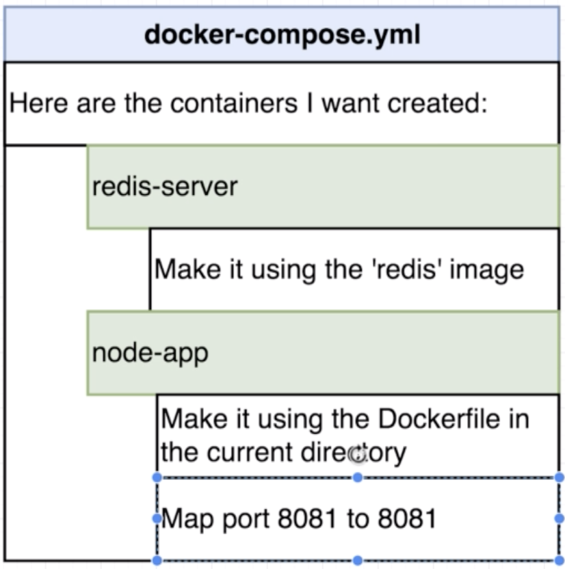

```
version: '3'
services:
  redis-server:
    image: 'redis'
  node-app:
    build: .
    ports:
      - "4001:8081"
```

- `version: '3'` specifies the version of docker compose we want to use
- `services` essentially refers to containers we want to build
- `redis-server:
    image: 'redis'` tells docker to build a new container (service) using the image `redis`
- `node-app:
    build: .` tells docker to build a new container (service) using the Dockerfile in the working directory
- `ports: - "4001:8081"`  tells docker to map port 4001 of local machine to port 8081 of container

### Networking with Docker Compose
By using containers within one docker compose environment, the containers share a network and we don't have to do any additional steps to connect tqo or more containers.

### Docker Compose Commands
`docker-compose up` similar to `docker build .`+`docker run <image-name>`

Comparison with `docker run` and `docker build`:
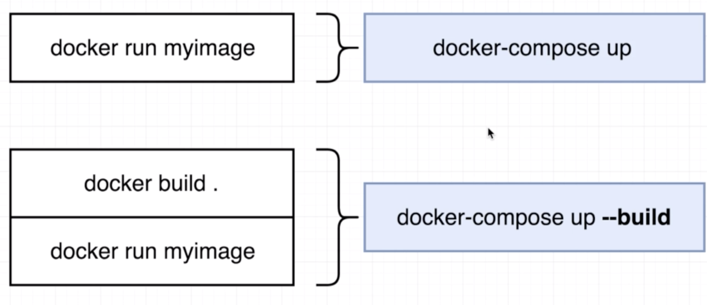

### Launching and stopping containers in the background

- `docker-compose up -d`
- `docker-compose down`


### Automatic Container Restarts 
Restart policies:
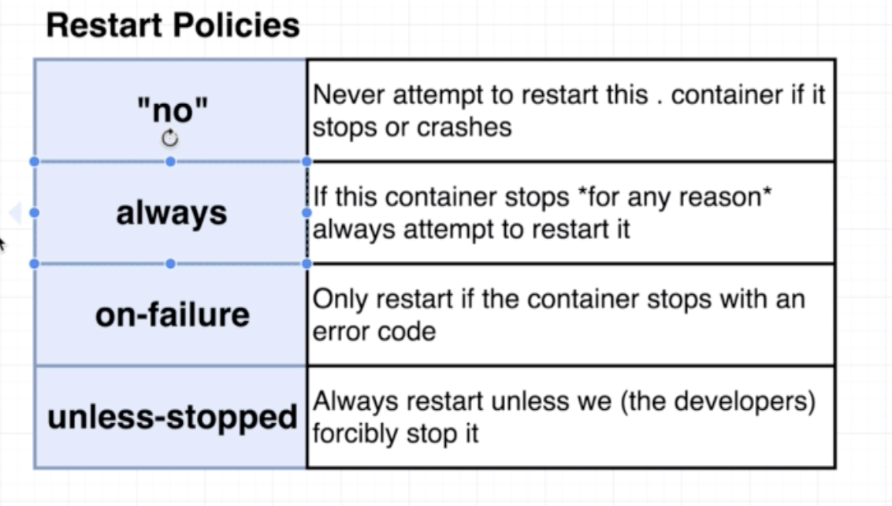

We can program this restart policy in the `docker-compose.yml` file as such:

```
version: '3'
services:
  redis-server:
    image: 'redis'
  node-app:
    restart: always
    build: .
    ports:
      - "4001:8081"
```
- no policy: it is the default policy. If we want to add it into the `docker-copmpose.yml` file, we can add the line `restart: "no"` the single/double quotes are important because `no` means something else in the yml file.
- always policy: good to have if running a web-server 
- on-failure policy:if some worker process is running and it faces an error, good to let it die

### Checking container status
Like `docker ps` we can run `docker-compose ps`. However, `docker-compose ps` should be run from the working directory where the `docker-compose.yml` is present. 


### Docker Volumes
Similar to port fowarding, using docker volumes is a mapping from files/folders in the container to files/folders on the local machine.

`docker run -v /app/node_modules -v $(pwd):/app <image-id>`

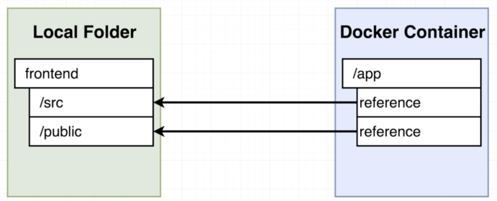

The `-v /app/node_modules` part of the command is to tell docker to use these directory and files from within the container instead of using a reference from the local machine.

To run volumes using docker compose, write your `docker-compose.yml` as such:

```
version: '3'
services:
  web:
    build: Dockerfile.dev
    ports:
      - "3000:3000"
    volumes:
      - /app/node_modules 
      - .:/app
```

### Overriding Dockerfile Selection in docker-compose.yml
```
version: '3'
services:
  web:
    build:
      context: .
      dockerfile: Dockerfile.dev
    ports:
      - "3000:3000"
    volumes:
      - /app/node_modules 
      - .:/app
```

### Multi-step Docker Builds
We can build an image from multiple base images using a multi-step approach as such:
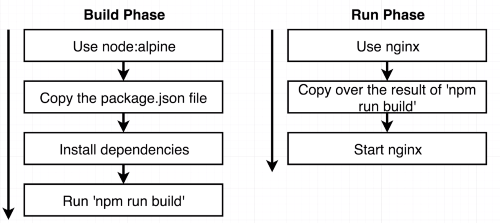

```
FROM node:alpine as builder

WORKDIR '/app'

COPY package.json .
RUN npm install
COPY . .

RUN npm run build

FROM nginx
COPY --from=builder /app/build /usr/share/nginx/html
```

# Travis CI
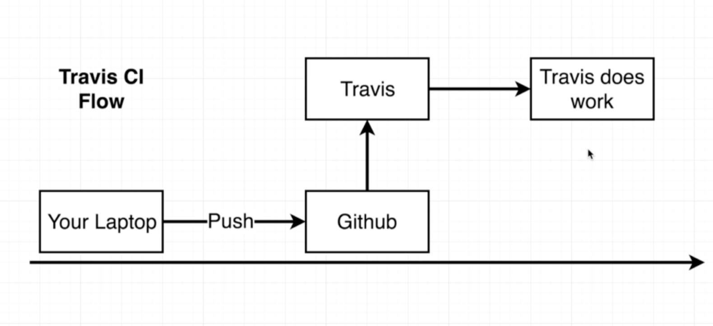

- Travis CI watches any pushes to Git
- Travis CI pulls all the code in the repo
- It can then:
	- Test
	- Deploy
	- Etc.

### Travis CI Config for Testing
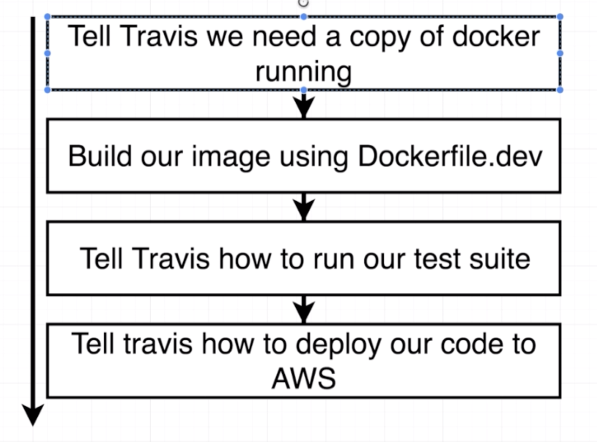

`.travis.yml` 

```
sudo: required
services:
  - docker

before_install:
  - docker build -t aish/docker-react -f Dockerfile.dev .

script:
  - docker run aish/docker-react npm run test -- --coverage
```


### Travis CI Config for Deployment

```
sudo: required
services:
  - docker

before_install:
  - docker build -t aish/docker-react -f Dockerfile.dev .

script:
  - docker run aish/docker-react npm run test -- --coverage

deploy:
  provider: elasticbeanstalk
  region: "us-east-1"
  app: "docker-react"
  env: "DockerReact-env"
  bucket_name: "elasticbeanstalk-us-east-1-015820542059"
  bucket_path: "docker-react"
  on:
    branch: master

  access_key_id:
    secure: $AWS_ACCESS_KEY
  secret_access_key:
    secure: "$AWS_SECRET_KEY"

```


# Kubernetes

## Overview
### What is Kubernetes? Why Kubernetes?
System for running many different containers over multiple different machines. 

We need kubrenetes in a scenario where we need to run many different containers with different images. In the case that an application only relies on one kind of container, Kubernetes may not necessarily be the right solution.
A typical Kubernetes architecture looks like this:


### Minikube Architecture


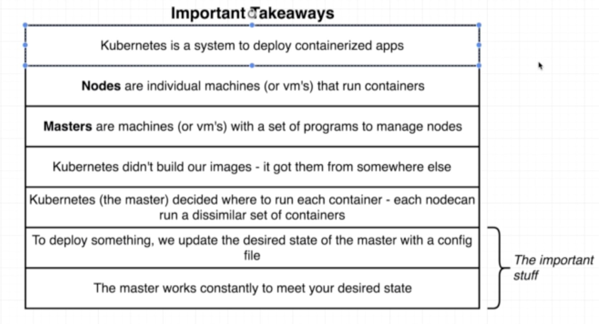 


### 'Mapping' from Docker Compose to Kubernetes


### Config Files in K8s
While in Docker we use the config file (Dockerfile or docker-compose file) to create containers, in K8s we use config file to create objects.

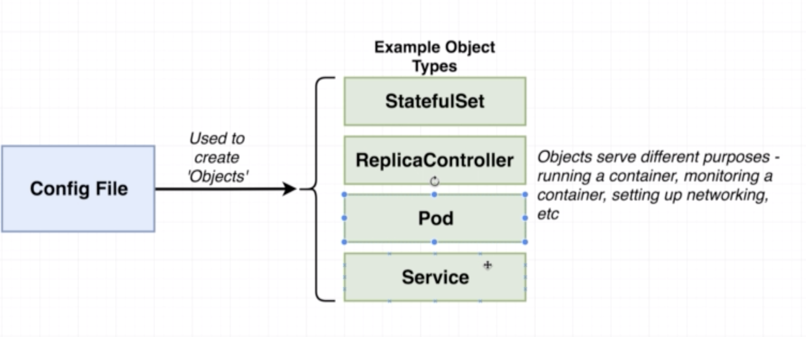


### Pod

- A pod is a smallest unit object in K8s. 
- It is a grouping of containers with a common purpose. 
- In K8s we don't deal with one naked single container by itself. 
- The smallest thing we can deploy is a pod. A pod must have 1 or more contianers inside of it. 
- Containers in a pod should be tightly related to each other. In the example below, the logger and backup-manager containers depend on the postgres container and hence belong in the same pod. 
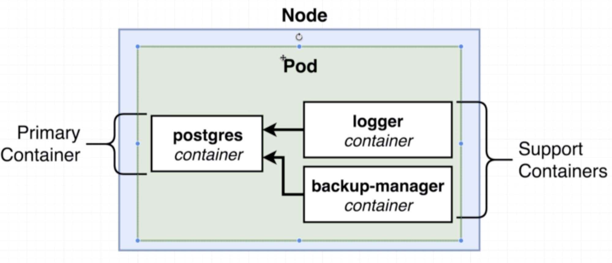

```
apiVersion: v1
kind: Pod
metadata:
  name: client-pod
  labels:
    component: web
spec:
  containers:
    - name: client
      image: aishpra/fib-client
      ports:
      - containerPort: 3000
```

- apiVersion: scopes or limits the types of objects we can use in a given config file
- kind: type of object that is being defined in the config file, in this case a Pod
- metadata: all the information about the pod itself
	- name: tag used for kubectl and logging etc.
	- labels: useful for Services
- containers: the config of the containers inside the pod
	- name: is a tag used to refer to the specific container, useful for tagging and networking
	- image: the image that the container is going to be made out of
	- ports: config related to ports of the container
		- containerPort: the port of the container that will be exposed

### Deployment

Very fiew fields in a Pod config can be changed/updated

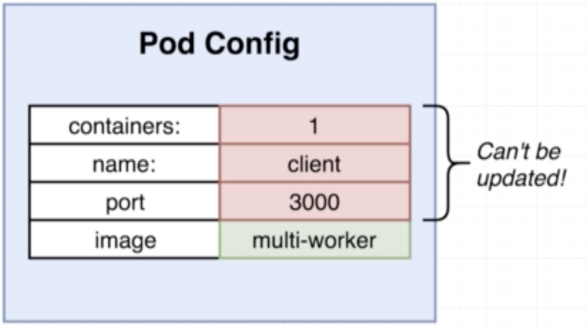

- A deployment maintains a set of identical pods, ensuring that they have the correct config and that the right number exists.
- It continuously watches all the pods related to itself and ensures that they are in the right state
- When a change is made in the deployment config, either the pods are altered or killed and a new one created

```
apiVersion: apps/v1
kind: Deployment
metadata:
  name: client-deployment
spec:
    replicas: 1
    selector:
      matchLabels:
        component: web
    template:
      metadata:
        labels:
          component: web
      spec:
        containers:
          - name: client-deployment
            image: aish/fib-client
            ports:
              - containerPort: 3000
```

- apiVersion: scopes or limits the types of objects we can use in a given config file
- kind: type of object that is being defined in the config file, in this case a Deployment
- metadata: all the information about the deployment itself
- spec: specifications related tp tje deployment
	- replicas: number of identical pods to create
	- selector and labels: handles for 'connecting' deployment and pod
		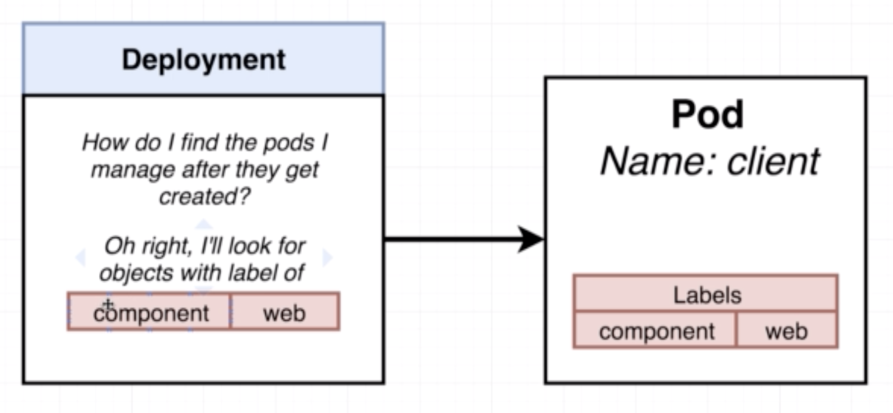
	- template: template of the pod


#### Differene between Pod and Deployment

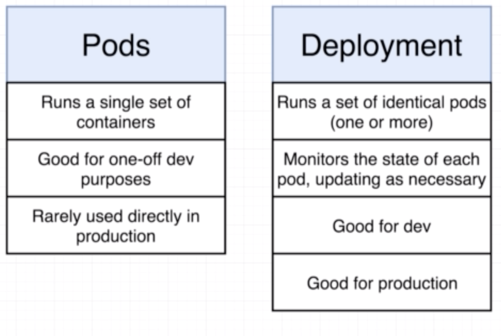


#### How to update image in a deployment

3 different ways of doing so:

1. Manually delete pods to get the deployment to recreate them with the latest version
2. Tag built images with a real version number and specify that version in the config file
3. (Recommended) Use an imperative command to update the image version the deployment should use 

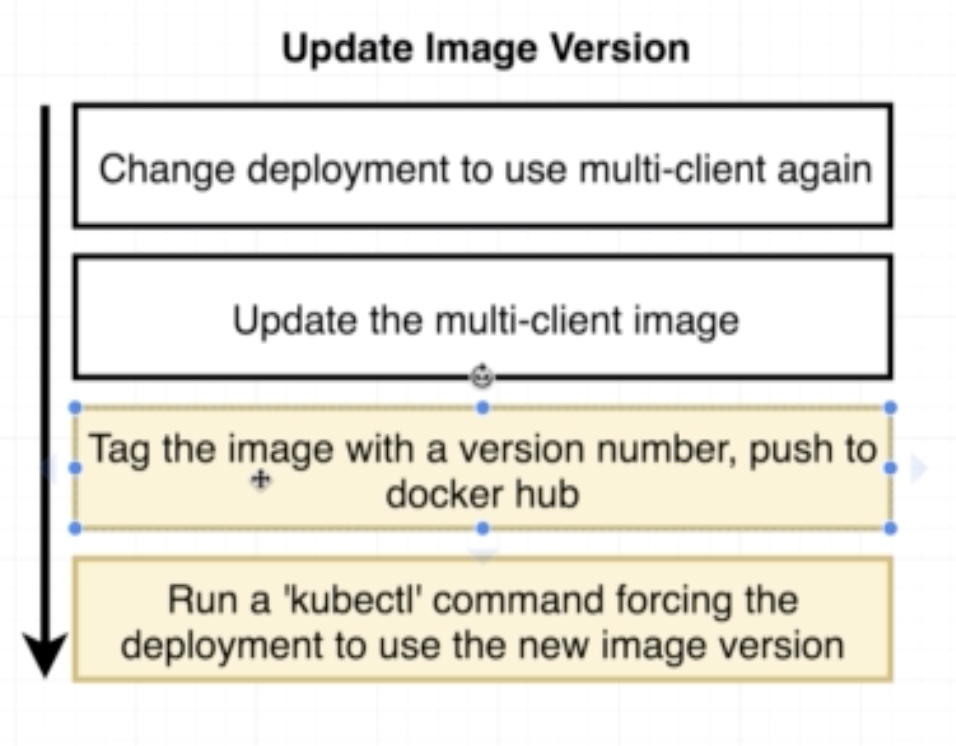

`kubectl set image <object-type>t/<object-name> <container-name>=<new-image-to-use>`

A neat trick to use 
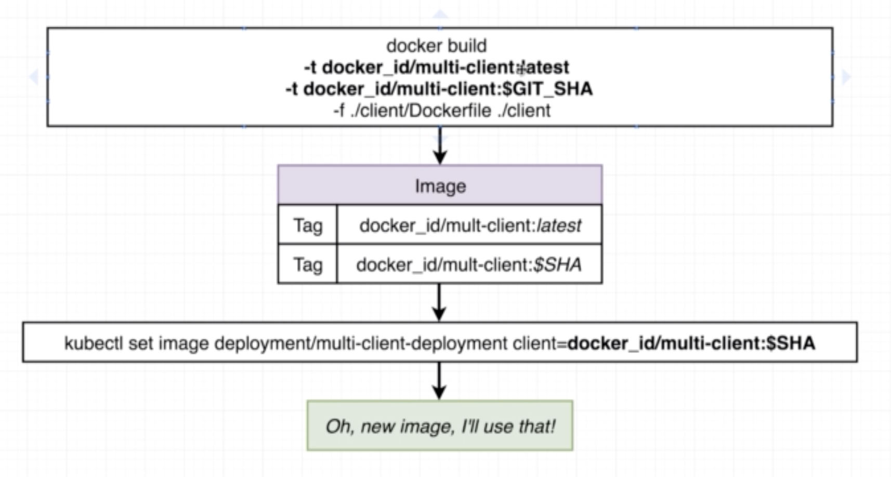

Advantage of using GIT_SHA:
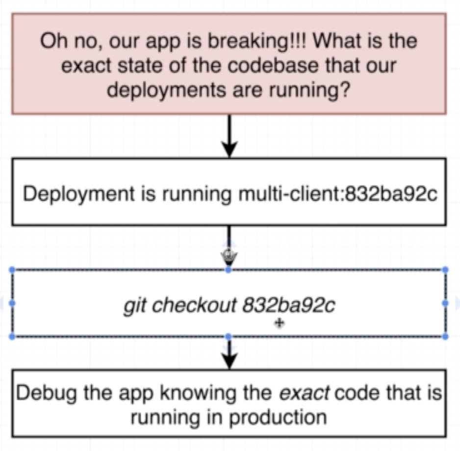

### Services

- Sets up networking in a K8s CLuster
- There are 4 different kinds of services ClusterIP, NodePort, LoadBalancer and Ingress
- We need services because pods get deleted and updated in the nodes all the time, so services help us watch the pods which match its selector and automatically route traffic to them even though their IP adress might change during update


### NodePort

- NodePort exposes a contianer to the outside world
- Typically used only for development purposes and not in production 


```
apiVersion: v1
kind: Service
metadata:
  name: client-node-port
spec:
  type: NodePort
  ports:
    - port: 3050
      targetPort: 3000
      nodePort: 31515
  selector:
    component: web
```

- apiVersion: scopes or limits the types of objects we can use in a given config file
- kind: type of object that is being defined in the config file, in this case a Service
- metadata: all the information about the service itself
- spec: config related to the Service
- type: either ClusterIP, NodePort, LoadBalancer and Ingress
	- ports: config related to the ports
		- port: the port used by other pods to communicate to a specific pod
		- targetPort: connects to the port that is exposed on a pod that this service is related to
		- nodePort: exposed to the outside world. If not defined, assigned a random value.
		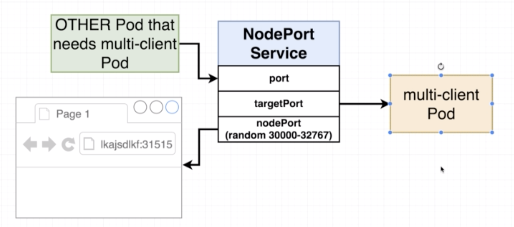
	- selector: config related to labels of pods. It looks for a key value pair to forward traffic to
		-  	component: completely arbitrary name, maps to the "labels: component: web" proprty in example pod config file

### ClusterIP

A ClusterIp is what allows a group of objects interact with one another. It is like. NodePort, in that it exposes a pod/set of pods but unlike a NodePort it does not allow access from the outside world. 

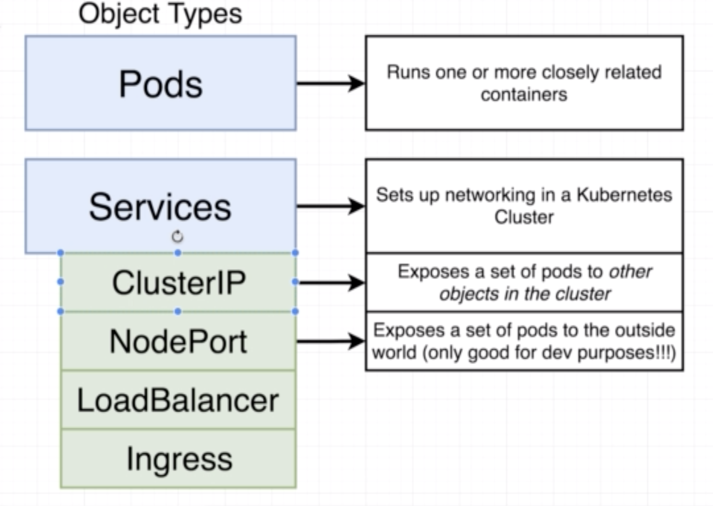


Example:

```
apiVersion: v1
kind: Service
metadata:
  name: client-cluster-ip-service
spec:
  type: ClusterIP 
  selector:
    component: web
  ports:
    - port: 5000
      targetPort: 5000
```
- port: port used to communicate with this ClusterIP object
- targetPort: port to which the requests are directed, typically will match the exposed port of the deployment

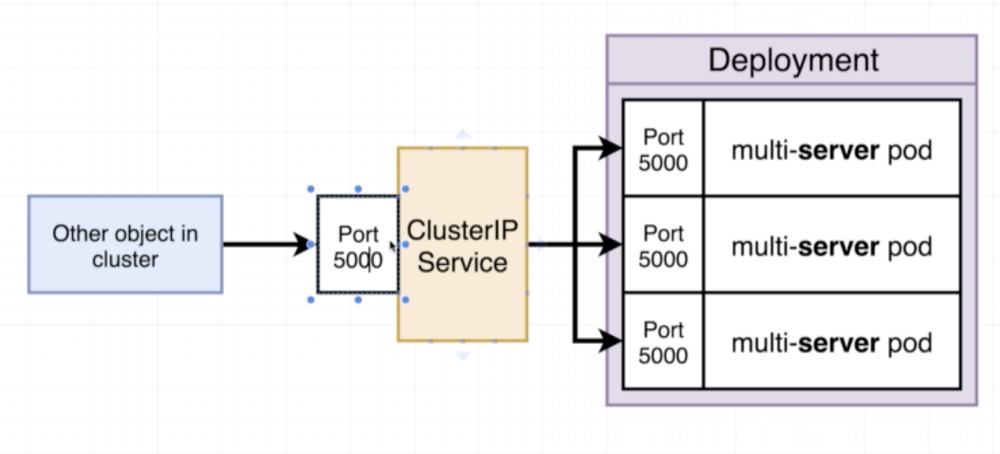 

### LoadBalancer
Legacy way of getting network traffic into a cluster.

- Allows access to a specific set of pods
- Sets up usage of native load-balancer (eg on AWS it will use the AWS LB)
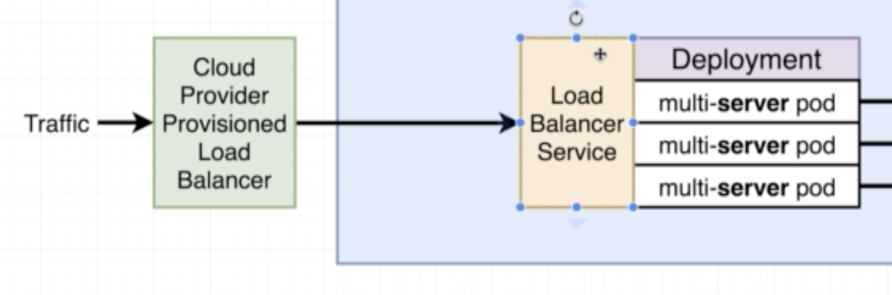 

### Ingress

 - Exposes a set of services to the outside world
 - It has several different implementations eg: ingress-nginx
 - Setup of ingress-nginx changes depending on the environment

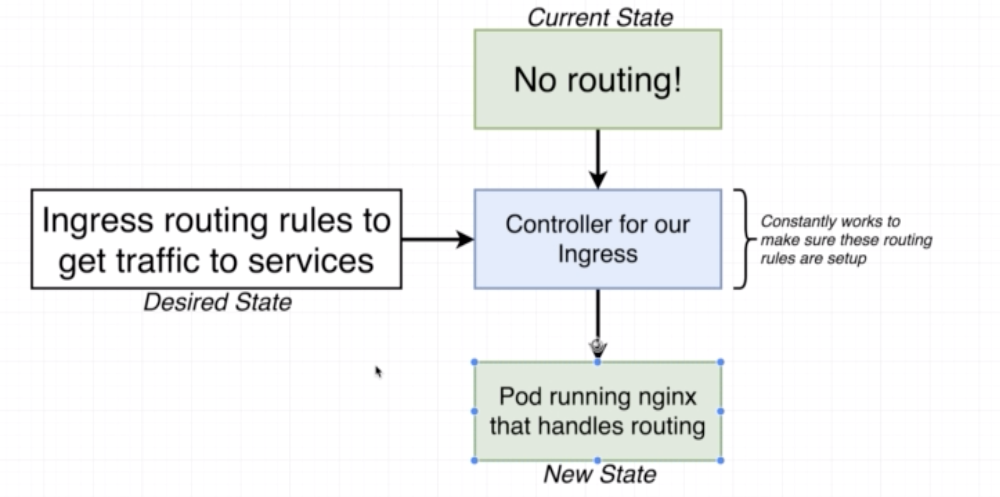 
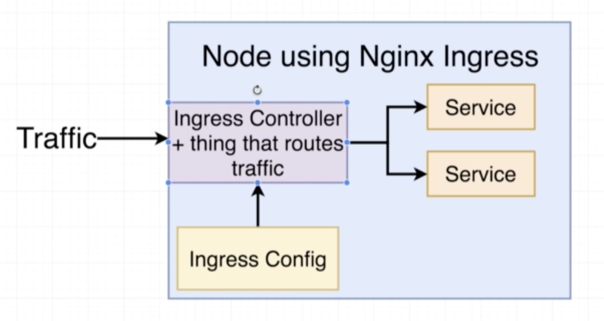 
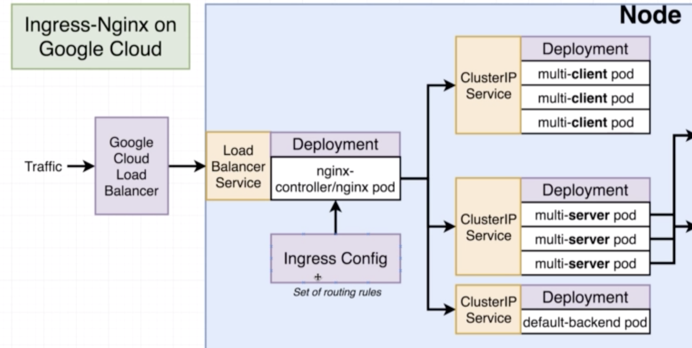 

```
apiVersion: extensions/v1beta1
kind: Ingress
metadata:
  name: ingress-service
  annotations:
    kubernetes.io/ingress.class: nginx
    nginx.ingess.kubernetes.io/rewrite-target: /
spec:
  rules:
    - http:
        paths:
          - path: /
            backend:
              serviceName: client-cluster-ip-service
              servicePort: 3000
          - path: /api/
            backend:
              serviceName: server-cluster-ip-service
              servicePort: 5000
```


### Volumes in K8s

#### Why might we need volumes?

For example in the case of a Postgres, if we create a deployment with a single pod and container, if the container crashes then a new one will be created. Even though a new contianer will be created, all the data stored in the previous container will be lost. Hence, we need a place to write this data into a file for availability of data. 

#### What is a volume?
An object that allows a container to store data at the pod level.
For exampe:


In the event that a container in the pod crashes, another container will be created and it can have the 'backup' of the data in the form of the files stored in pod level volumes. However, this still leaves the system vulnerable to data loss in the event that the pod itself crashes.

### Persistent Volume

Similar to volume but the persistent volume is outside the pod. A persistent volume will help to have 'backup' of data in the event that a pod crashes.
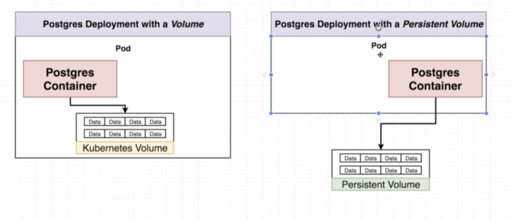

### Persistent Volume Claim
A persistent volume claim is a 'billboard advertisement' of the available memory options. A persistent volume claim is not an actual instance of storage. It is something we attach to a config to avail a persistent volume. There are two kinds of volumes that can be provisioned:

- Statically Provisioned Persistent Volume: Already created ahead of time
- Dynamically provisioned Persistent Volume: Created when requested by user through Pod Config

```
apiVersion: v1
kind: PersistentVolumeClaim
metadata:
  name: database-persistent-volume-claim
spec:
  accessModes:
    - ReadWriteOnce
  resources:
    requests:
      storage: 2Gi
  storageClassName:
```
- accessModes: three different kinds of access modes
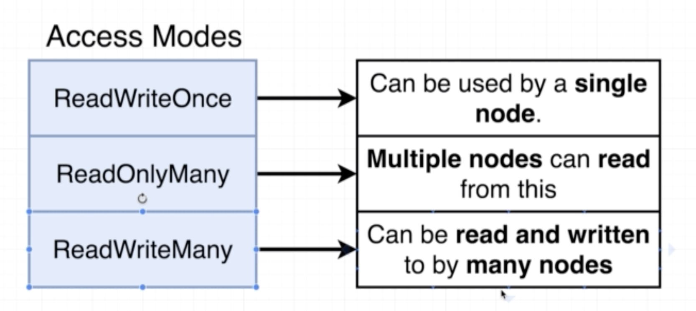
- storage: requesting exactly 2 GB of space

Example of deployment file:

```
apiVersion: apps/v1
kind: Deployment
metadata:
  name: postgres-deployment
spec:
  replicas: 1
  selector:
    matchLabels:
      component: postgres
  template:
    metadata:
      labels:
        component: postgres 
    spec:
      volumes:
        - name: postgres-storage
          persistentVolumeClaim:
            claimName: database-persistent-volume-claim
      containers:
        - name: postgres
          image: postgres 
          ports:
            - containerPort: 5432
          volumeMounts: 
            - name: postgres-storage
              mountPath: /var/lin/postgresql/data
              subPath: postgres
```
- volumes: 
	- name
	- persistentVolumeClaim: this part of the config reached out to K8s to let it know that storage resources need to be allocated as specified in the file corresponding to claimName.
- volumeMounts:
	- name: matches the name specified under spec/volumes
	- mountPath: where in the container should the data be stored
	- subPath: a subfolder to store the data. Quite specific to postgres

	
#### Where does K8s allocate persistent volumes?
On your personal computer:
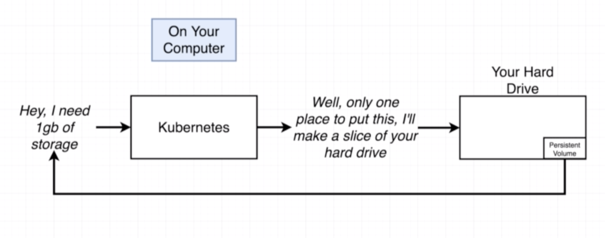

You can check available options available using `kubectl get storageclass` or `kubectl describe storageclass`


- storageClassName: used to point to where the volume storage will be allocated. Can be left out and let K8s use the default.

### Secret

Securely stores a piece of information in the cluster, such as a database password.

`kubectl create secret generic <secret-name> --from-literal key=value`
- generic cna also be docker-registry or tls
- The corresponding config file looks like:

```
apiVersion: apps/v1
kind: Deployment
metadata:
  name: server-deployment
spec:
  replicas: 3
  selector:
      matchLabels:
        component: server
  template:
    metadata:
      labels:
        component: server
    spec:
      containers:
        - name: server
          image: stephengrider/multi-server
          ports:
              - containerPort: 5000
          env:
            - name: REDIS_HOST
              value: redis-cluster-ip-service
            - name: REDIS_PORT
              value: 6379
            - name: PGUSER
              value: postgres
            - name: PGHOST
              value: postgres-cluster-ip-service
            - name: PGPORT
              value: "5432"
            - name: PGDATABASE
              value: postgres
            - name: PGPASSWORD
              valueFrom:
                secretKeyRef:
                  name: pgpassword 
                  key: PGPASSWORD
```

## Other useful K8s information/commands

### Adding Environment Variables to Config

```
apiVersion: apps/v1
kind: Deployment
metadata:
  name: server-deployment
spec:
  replicas: 3
  selector:
      matchLabels:
        component: server
  template:
    metadata:
      labels:
        component: server
    spec:
      containers:
        - name: server
          image: stephengrider/multi-server
          ports:
              - containerPort: 5000
          env:
            - name: REDIS_HOST
              value: redis-cluster-ip-service
            - name: REDIS_PORT
              value: 6379
            - name: PGUSER
              value: postgres
            - name: PGHOST
              value: postgres-cluster-ip-service
            - name: PGPORT
              value: 5432
            - name: PGDATABASE
              value: postgres

```

### Change current configuration of cluster
`kubectl apply -f <filename>`

### Get status of objects
`kubectl get <object>`

### Describing contents of an object
`kubectl describe <object> <object-name>`

### Deleting an object (imperative)
`kubectl delete -f <filename>`

### Imperative vs Declarative Deployments (using image as an example)

`kubectl set image <object-type>t/<object-name> <container-name>=<new-image-to-use>`

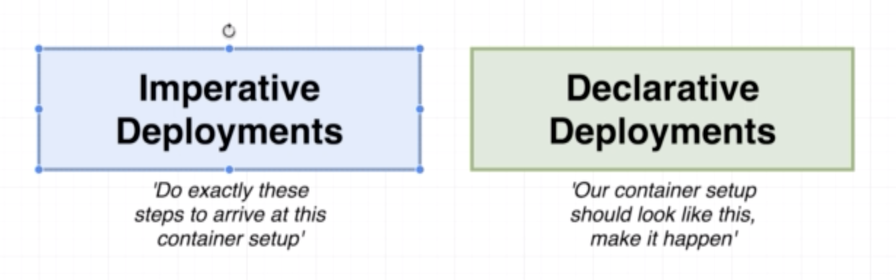
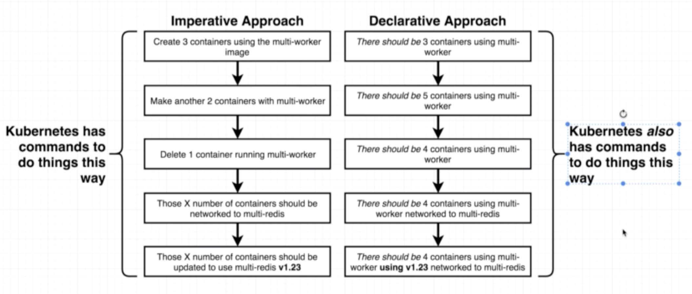

### Updating Existing Objects (Declarative)
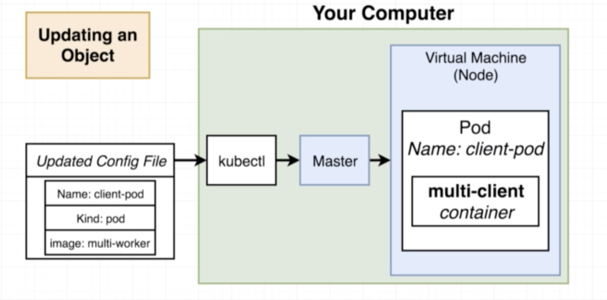

When we make a change to any config file and then use `kubectl apply -f <filename>` the Master node looks for the name and kind in the config file to ensure that there exists such an object and then it updates the object with the changed config file.

### How to 'talk' to Docker inside minikube

`eval $(minikube docker-env)`
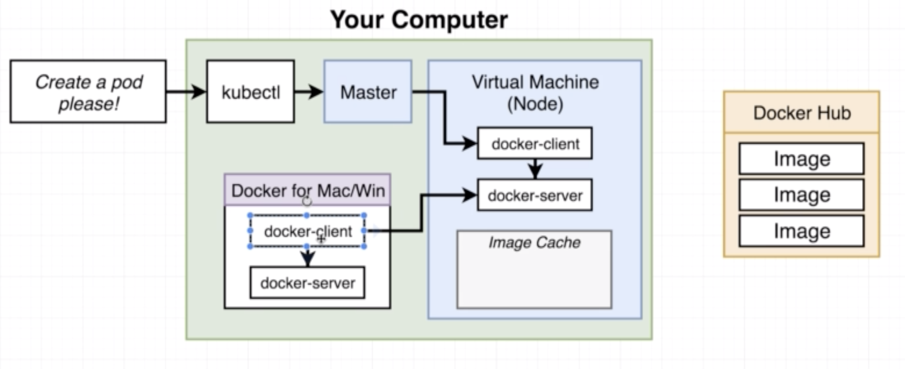
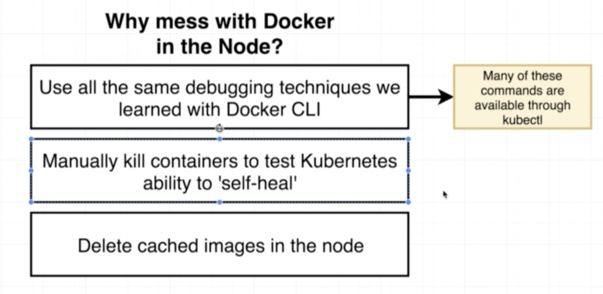

### Applying multiple files with kubectl
To apply a group of config files use `kubectl apply -f <directory-name>`

### Combining config files into one file

Use `---`

```
apiVersion: v1
kind: Service
metadata:
  name: server-cluster-ip-service
spec:
  type: ClusterIP
  selector:
    component: server 
  ports:
    - port: 5000
      targetPort: 5000
---
apiVersion: apps/v1
kind: Deployment
metadata:
  name: server-deployment
spec:
  replicas: 3
  selector:
      matchLabels:
        component: server
  template:
    metadata:
      labels:
        component: server
    spec:
      conatiners:
        - name: server
          image: stephengrider/multi-server
          ports:
              - containerPort: 5000
              
```

### What is a controller?
A controller is an object that constantly works to ensure that the state of the cluster adheres to the changes in the config. Eg: deployment, ingress controller.


### RBAC
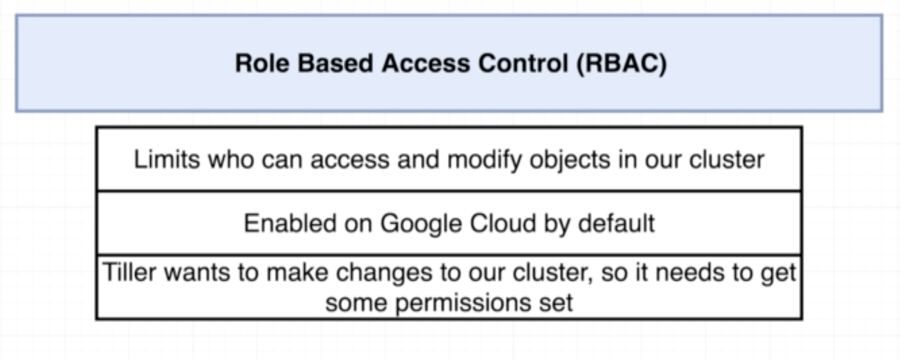
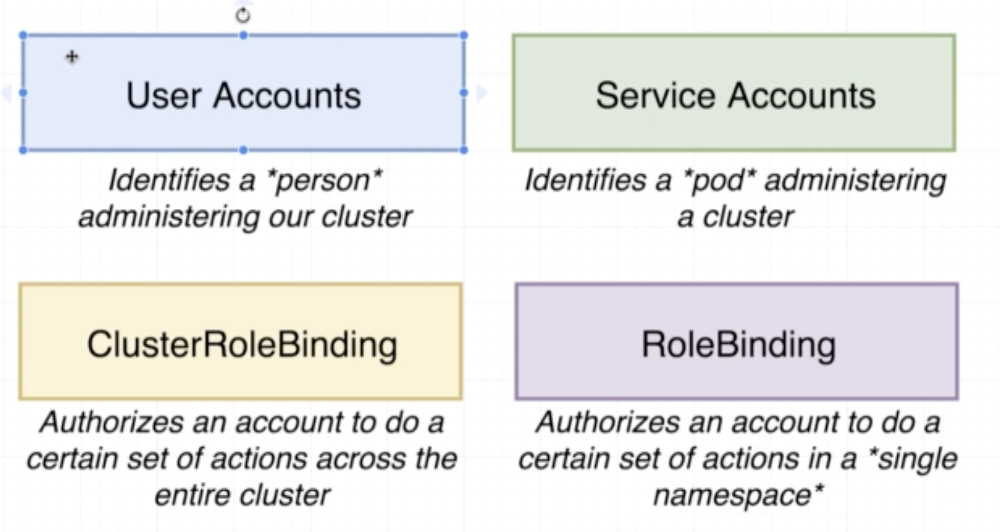
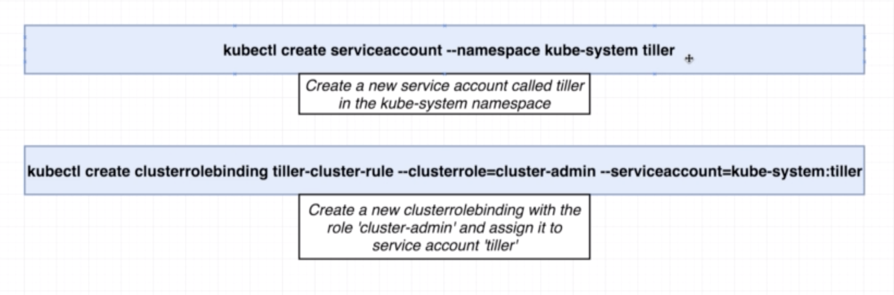


