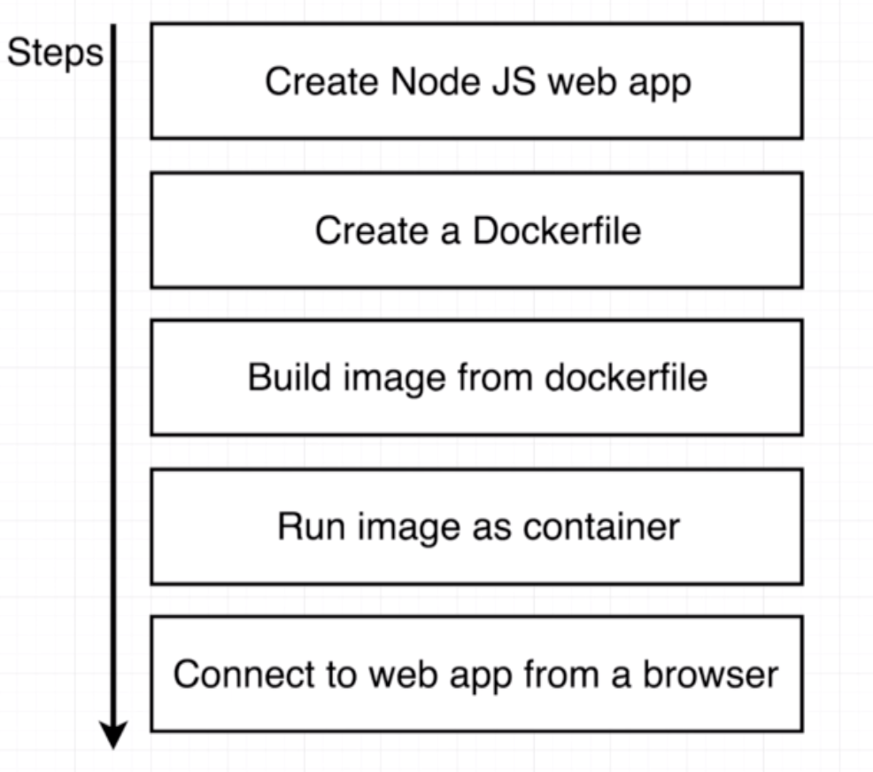

# Simple Web App using Docker and NodeJS

## Overview


###Create Node JS web app
package.json

```
{
	"dependencies":{
		"express":"*"
	},
	"scripts":{
		"start":"node index.js"
	}
}
```

index.js

```
cons express = require('express');

const app = express();

app.get('/',(req,res) => {res.send('Hi there');});

app.listen(8080, () => {console.log('Listeing on port 8080');});
```

Dockerfile

```
#Specify a base image

FROM node:alpine

#Ensure there is 
WORKDIR /usr/app

COPY ./package.json ./

#Install some dependencies
RUN npm install

#Copy everything else
COPY ./ ./

#Default command
CMD ["npm","start"]

#docker build -t aish/simpleweb .
#docker run -p 8080:8080 aish/simpleweb
```