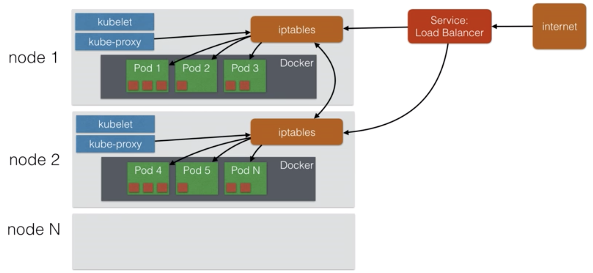

### Node Architecture

- Pods run the containers (red squares)
- Kubelet is responsible for launching and maintaining nodes. It gets this information from the master node.
- Kube-proxy changes the iptables to make sure that traffic from outside can be routed to the pods in the cluster

### Scaling Pods

In order to horizontally scale pods/containers, the application needs to be stateless.
- Statless = your application doesn't have a state, it doesnt write any local files/keep local sessions
